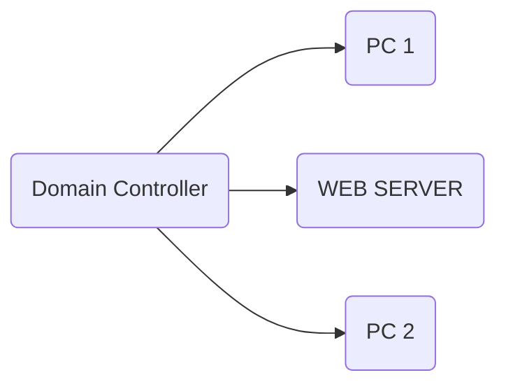
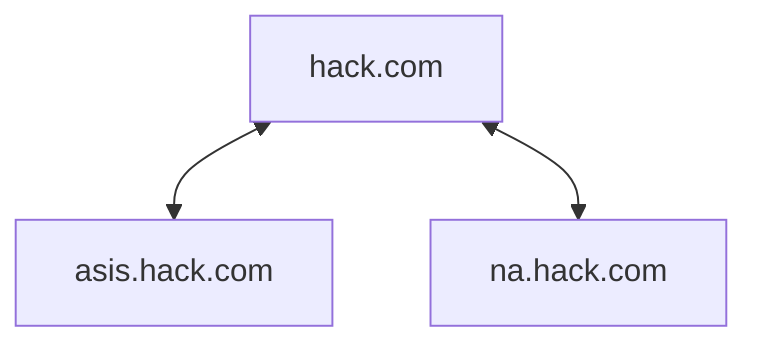
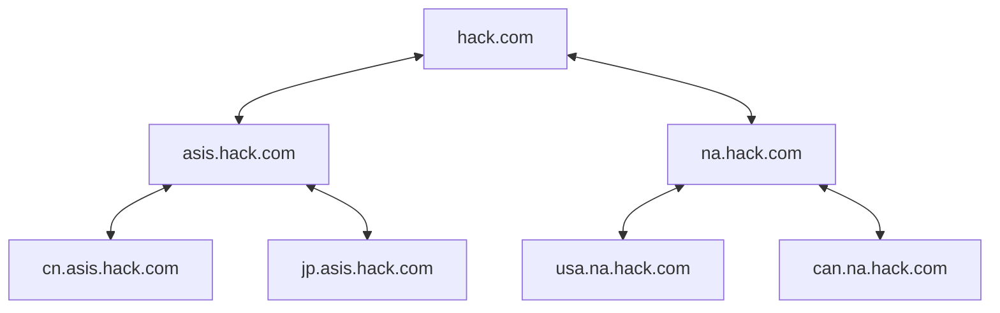

# **内网**

# 基础概念内容


## 内网工作环境

### 工作组

就网上邻居，这个简单

### 域

其实可以理解为多个工作组，然后互相访问之间需要统一的管理和集中身份验证。

#### 单域

这个很简单就是普通一个域



#### 父域和子域

呃，就是在有时候需要在一个域下面弄另外一个域，也就是子域，从域名来看，因为子域是父域下面一个段，用点来分割。看图更清楚：




#### 域树

基于子域和父域，可以生成域树。



域管理员只能管理自己的，管不了别人。域和域之间搞就需要建立信任关系

#### 域林

域林就是在域树的基础上在进行变化，

域林和域树的区别就是域林的命名规则**是不连续的**，但域林中的域树仍然共享同一个表结构，配置，和全局目录


#### 目录服务和LDAP

```mermaid

```


## 说一下你的内网渗透测试思路

0.明确目标，测试目标的范围，IP，域名，内外网

1.信息收集，资产收集，假如给我一个企业，可以先尝试搜集其子公司。收集其控股的子公司，然后对子公司再次收集。

3.利用扫描工具（nmap，站长工具等）

- 基础信息：IP，网段，域名，端口
- 系统信息：操作系统版本
- 应用信息：各端口的应用，例如web应用，邮件应用等等
- 版本信息：所有这些探测到的东西的版本。
- 服务信息
- 人员信息：域名注册人员信息，web应用中网站发帖人的id，管理员姓名等。
- 防护信息：试着看能否探测到防护设备

4.找洞

漏扫，awvs，IBM appscan等。在网上寻找验证poc。系统漏洞：系统没有及时打补丁 Websever漏洞：Websever配置问题。其它端口服务漏洞：各种21/8080(st2)/7001/22/3389

5.信息分析

为下一步实施渗透做准备。

- 精准打击：准备好上一步探测到的漏洞的exp，用来精准打击
- 绕过防御机制：是否有防火墙等设备，如何绕过（一般在授权测试的时候是没有防火墙的）
- 定制攻击路径：最佳工具路径，根据薄弱入口，高内网权限位置，最终目标
- 绕过检测机制：是否有检测机制，流量监控，杀毒软件，恶意代码检测等（免杀）
- 攻击代码：经过试验得来的代码，包括不限于xss代码，sql注入语句等


## 内网渗透测试工具有哪些？

扫描工具： 

- NMAP扫端口，语法：

```
 nmap -A -T4 -v IP地址
```

- IPSCAN,

- fierce --domain  baidu.com 返回网址的IP

- WEBSCAN 扫站点

- 御剑目录扫描器

- dirb 

  ```
  格式：dirb <url_base> [<wordlist_file(s)>] [options]
  
  -a 设置user-agent
  
  -p <proxy[:port]>设置代理
  
  -c 设置cookie
  
  -z 添加毫秒延迟，避免洪水攻击
  
  -o 输出结果
  
  -X 在每个字典的后面添加一个后缀
  
  -H 添加请求头
  
  -i 不区分大小写搜索
  
  ```

## 说一说常见的内网信息收集内网如横向渗透？

### 内网信息收集

包括操作系统，当前用户权限，内网ip段，杀毒软件，端口开放情况，系统打的补丁，网络状况，共享文件夹等，如果是域内的主机的话，操作系统、补丁、运行的服务、杀软等一般是域管批量用脚本安装的。

然后看是WINDOWS还是LINUX。

假如是windows的话：

#### WINDOS：

本机网络配置：ipconfig /all

查询操作系统及版本信息，补丁信息等等 systeminfo


内网横向渗透有什么思路？遇到 360 防护你会怎么办？了解内网提权吗？
内网的 hash 传递原理是什么？
内网中除了哈希传递攻击还有什么方式免密登录到其他的机器？内网怎么去找到域管理员的机器?
现在菜刀连接了一台内网主机，怎么快速地登录上线？在内网中用 nmap 扫描，怎样让对方发现不了？
已经通过 webshell 进入内网，发现内网中有一台服务器你的后续攻击思路是什么？内网机器有杀软怎么拿 shell？
给你一个待上线的内网系统你如何测试？
给你一个网站域名，怎么拿内网系统的权限？内网中给你 admin 的账号怎么获取密码？
内网漫游以及如何提权？
给你一个网站 shell 你会怎么打内网？
给你一个场景你的电脑连上了内网，给你一个 ip192.1.1.1 访问，访问不到，怎么进行信息收集？内网遇到 docker 环境如何逃逸 ？
内网代理工具有哪些?
怎么利用 xxe，log4g2 去打内网？
说一下内网渗透和域渗透的一个区别和渗透方式怎么样才能收集到内资产?
fscan 是否用过？内网穿透工具有哪些？给你一个不出网的 linux 服务器，当前权限为 iis ，怎么渗透？